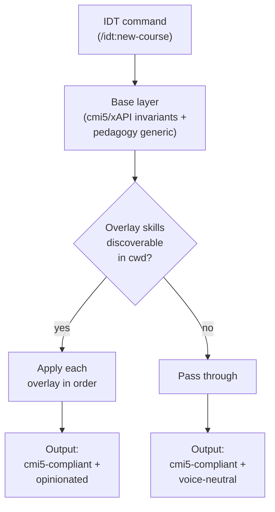

# Base + Overlay pattern for IDT — Design

**Status:** Proposed (spike recommendation)

## Problem

`instructional-design-toolkit` (IDT) is sold as a multi-tenant authoring toolkit. Its README markets it for "instructores externos, founders de startups Launchpad, equipos internos" — three audiences with different editorial expectations. At the same time, Dojo Coding internal teams have strong opinions about voice ("Builder-First, AI-Native"), structural conventions ("text classes carry the course"), and a named pedagogical formula (`CONTEXT → CONCEPT → BUILD → SHIP → REFLECT`) that they want IDT to apply when authoring Dojo content.

If IDT bakes those opinions into its base templates, every external user inherits Dojo voice silently — captured editorial opinion. If IDT stays voice-neutral always, Dojo loses authoring leverage when working in dojo-academy. We need a third path.

## Decision

IDT adopts a **Base + Overlay** pattern with three orthogonal layers:



### Layer 1 — Standard invariants (IDT base, always)

cmi5/xAPI structural invariants. Universal across any LMS. Never optional.

- `au_id` immutability (cmi5 spec — changing this breaks every learner's xAPI history)
- `activity_type` IRI consistency
- Open Badges 3.0 / W3C VC stability rules for credentials
- Semver classification (MAJOR/MINOR/PATCH per `course-revise`)
- Bloom's Taxonomy mapping for learning objectives
- Kirkpatrick L1-L4 evaluation framework

These ship inside IDT and are NEVER overridable. Even an overlay cannot remove `au_id` or change its immutability. The `cmi5-metadata-writer` agent enforces this — it aborts if any overlay output violates the invariant.

### Layer 2 — Pedagogy generic (IDT base, always)

Universal pedagogy with a defended opinion. Ships inside IDT. Overlays can extend or annotate but should not contradict.

- SAM > ADDIE (per Allen 2012 — iterative cohort prototyping)
- Atomic Habits applied to lessons (Clear 2018 — `cue → craving → response → reward`)
- Irby 2018 coach/mentor/tutor distinction (`session-type-detector`)
- Ship-First Design (every course ends with a tangible deliverable)
- Course versioning rules (semver bump table)

### Layer 3 — Editorial voice (overlay, opt-in)

Voice register, named frameworks, structural conventions, quality rubrics. Lives outside IDT. Each consumer plants its own.

For dojo-academy, the overlays are:

- `academy-philosophy` (Dojo voice — "Builder-First, AI-Native", named frameworks like "Builder Mindset" and "Multi-Quading", default tool refs to Claude, momentum endings)
- `content-standards` (Dojo formula `CONTEXT → CONCEPT → BUILD → SHIP → REFLECT`, "text classes carry the course" load-bearing rule, quality rubric from `deep-guide-challenge-brief.md`)

Overlays MUST NOT contradict Layer 1 (the runtime aborts the run with a clear error if they do). Overlays SHOULD NOT contradict Layer 2 — violations log a visible warning naming the overlay's `SKILL.md` path but do not abort, since Layer 2 is defended opinion rather than contract.

## Overlay protocol

### Discovery

When a IDT command runs, it walks the active plugin context (set by Claude Code from `cwd`):

1. Look for plugins declared in `<repo>/.claude-plugin/plugin.json`
2. Within each plugin's `skills/` directory, look for skills whose `SKILL.md` frontmatter declares an `overlay_target` field
3. Match overlays whose `overlay_target` includes the current command name (e.g. `new-course`, `course-audit`, `slides-preview`, `write-text-class`)
4. Order them by `overlay_priority` (lower → applied first; voice overlays default to higher priority so they apply LAST, after structural transforms). **Ties in `overlay_priority` are broken alphabetically by the overlay's `SKILL.md` path** (case-insensitive, normalized to forward slashes) so ordering is deterministic across operating systems and plugin discovery implementations.

**Default `overlay_priority` values** (use these unless you have a documented reason not to):

| Overlay kind | Default `overlay_priority` | Applied | Examples |
|---|---|---|---|
| Structural | `50` | early — reshapes document scaffold | `content-standards` (formula sections, load-bearing rule) |
| Generic | `75` | middle — annotates/extends without changing voice | locale enrichment, accessibility annotations |
| Voice / editorial | `100` | late — runs on the structured draft | `academy-philosophy` (Builder-First voice transforms) |

### Invocation

After IDT produces a Layer 1 + Layer 2 base draft:

```typescript
type OverlayInput = {
  command: string                // e.g. "new-course"
  baseDraft: object              // cmi5/xAPI-shaped object
  context: { cwd: string, repo: string, locale?: 'en' | 'es' }
}

type OverlayOutput = {
  draft: object                  // mutated/annotated draft
  warnings?: string[]            // non-fatal notes — surfaced in the user-facing
                                 // Claude response (not just internal logs).
                                 // Use this for "I couldn't find a hero image,
                                 // skipping that part" style notes.
}

function applyOverlay(input: OverlayInput): OverlayOutput
```

The runtime feeds each overlay the prior overlay's output. Final output is the last overlay's `draft`, validated again against Layer 1 invariants before write.

### Failure mode

| Situation | Behavior |
|---|---|
| Overlay throws an error | IDT emits a **visible warning in the user-facing Claude response** naming the failed overlay and its `SKILL.md` path (not just an internal log), then continues with the prior draft. Visibility is critical: silent skip would make "no overlays installed" indistinguishable from "overlays installed but broken" — exactly the failure mode the user-facing warning prevents. |
| Overlay output violates Layer 1 invariant (e.g. mutates `au_id`) | IDT aborts the run with a clear error pointing at the overlay's `SKILL.md` path. |
| Overlay output violates Layer 2 (e.g. contradicts SAM cohort sizing) | IDT logs a visible warning naming the overlay but proceeds — Layer 2 is defended opinion, not contract. |
| `<repo>/.claude-plugin/plugin.json` is missing or malformed (JSON parse error, schema validation failure) | IDT emits a visible warning naming the offending plugin path, **skips that plugin's overlays only** (other plugins still discovered), and continues with whatever overlays were found. |
| A plugin declares `overlay_target` for a command IDT does not implement | IDT silently ignores the registration (no warning — this is a forward-compat case for newer plugin versions). |
| No overlays found for a command | IDT emits the base draft directly — voice-neutral, cmi5-compliant. No warning needed. |

## Resolving the two duplicates

### `audit-course` (dojo-academy) ↔ `course-audit` (IDT)

**Decision:** IDT `course-audit` owns the command. dojo-academy `audit-course` is removed in [DOJ-3711](https://linear.app/dojo-coding/issue/DOJ-3711).

**What moves to overlay:** the Dojo-specific rubric (text-classes load-bearing rule, "deep-guide-challenge-brief" 5-criteria scoring) lands in `dojo-academy/skills/content-standards/SKILL.md` as an overlay registered against `course-audit`. When `/idt:course-audit` runs from `dojo-academy/`, the overlay augments the audit report with Dojo-specific findings (e.g. "Module 2 lacks load-bearing text classes — only video + quiz, violates Dojo rule").

### `plan-course` (dojo-academy) ↔ `new-course` (IDT)

**Decision:** IDT `new-course` owns the command. dojo-academy `plan-course` is removed in [DOJ-3711](https://linear.app/dojo-coding/issue/DOJ-3711).

**What moves to overlay:** the Dojo formula (`CONTEXT → CONCEPT → BUILD → SHIP → REFLECT`) lands in `dojo-academy/skills/content-standards/SKILL.md` as an overlay registered against `new-course`. When `/idt:new-course` runs from `dojo-academy/`, the overlay reshapes the lesson outline to mark each section with its formula stage and enforces the "BUILD section is >50% of every lesson" rule.

The Dojo voice (`academy-philosophy` overlay) ALSO applies to `new-course` outputs — runs after `content-standards`, layers in voice transforms ("the learner will" → "you will ship", named-framework introductions, etc).

## Why this design (alternatives considered)

| Alternative | Why rejected |
|---|---|
| **IDT bakes Dojo voice into base templates** | Captures every external user into Dojo's editorial opinion. Breaks IDT's multi-tenant pitch. Cannot be undone without forking. |
| **Two separate forks of IDT (`idt-base` + `idt-dojo`)** | Doubles maintenance cost. Diverges over time. Loses the "one toolkit, many consumers" leverage that justifies IDT in the first place. |
| **dojo-academy owns its own commands forever, IDT used only externally** | Surfaced 2026-05-01 as the original state. Causes silent duplication and drift between the two repos (`audit-course` vs `course-audit` already drifted, just on different rubrics). Worse for everyone. |
| **Convention via copy-paste (no runtime overlay)** | Every IDT update would require manual re-copy in dojo-academy. Updates lag. Drift returns. |

The Base + Overlay pattern is the only design that satisfies all four constraints simultaneously: (1) IDT stays multi-tenant, (2) Dojo voice is preserved for internal use, (3) zero silent capture for external users, (4) single source of truth per layer.

## Trade-offs

**Costs:**

- **One-time implementation** of the overlay-protocol mechanism in IDT (DOJ-3707) — estimated 1 PR, <500 LoC.
- **Plugin discovery edge cases** — when a user has multiple Dojo-flavored plugins installed (rare), overlay ordering must be deterministic. The `overlay_priority` field plus the alphabetical-tie-breaker rule in the Discovery section above handle this. Default priorities (50 / 75 / 100 for structural / generic / voice) are codified in the Discovery table.
- **Overlay protocol stability** — once shipped, the input/output contract is hard to change. Document conservatively.

**Benefits:**

- **External consumers stay clean.** A Launchpad founder running `/idt:new-course` from their own repo gets cmi5-compliant, voice-neutral output. No surprise voice capture.
- **Dojo voice evolves independently.** When Dojo changes "Builder-First" to "Founder-Builder" in 2027, only `dojo-academy/skills/academy-philosophy/SKILL.md` changes. IDT and external consumers are unaffected.
- **Single source of truth per layer.** Layer 1 only in IDT. Layer 3 only in dojo-academy (and any future Dojo content repo). No drift.
- **The pattern generalizes.** Future overlay needs (locale variants, certification-specific rubrics, partner-co-branded courses) all use the same protocol. No bespoke wiring per case.

## Concrete next steps for implementers

This proposal hands off to:

1. **[DOJ-3707](https://linear.app/dojo-coding/issue/DOJ-3707)** — implements the overlay-protocol mechanism in IDT (`new-course`, `course-audit`, `slides-preview` commands).
2. **[DOJ-3710](https://linear.app/dojo-coding/issue/DOJ-3710)** — converts `academy-philosophy` and `content-standards` skills in dojo-academy to comply with the overlay protocol.
3. **[DOJ-3711](https://linear.app/dojo-coding/issue/DOJ-3711)** — removes the two duplicate commands (`audit-course`, `plan-course`) from dojo-academy.

Both implementers should treat this proposal's `design.md` as the contract. Surface clarifications back to this change folder via comments / amendments — do NOT diverge silently.
